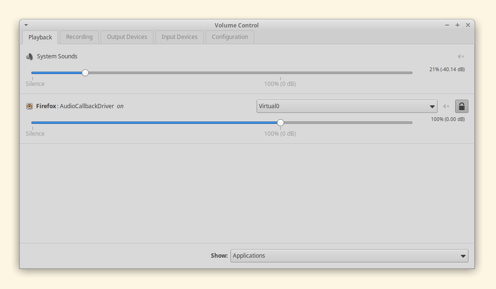
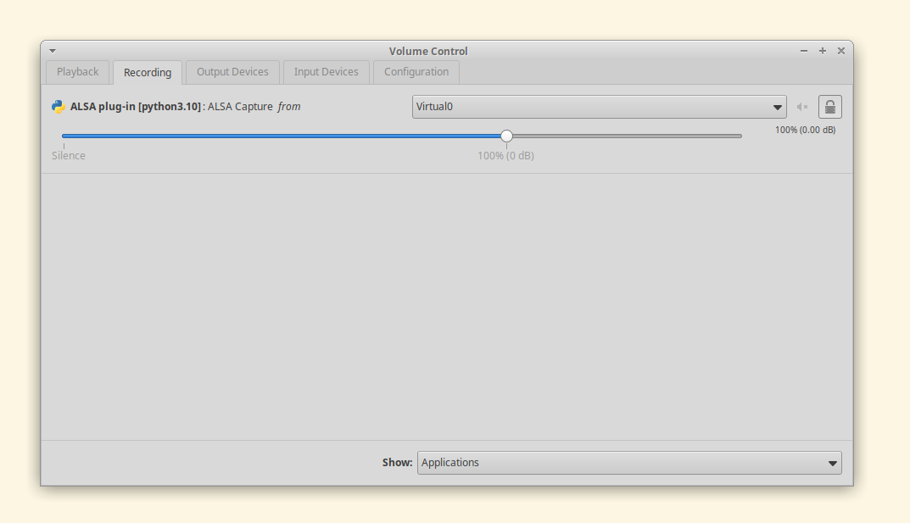
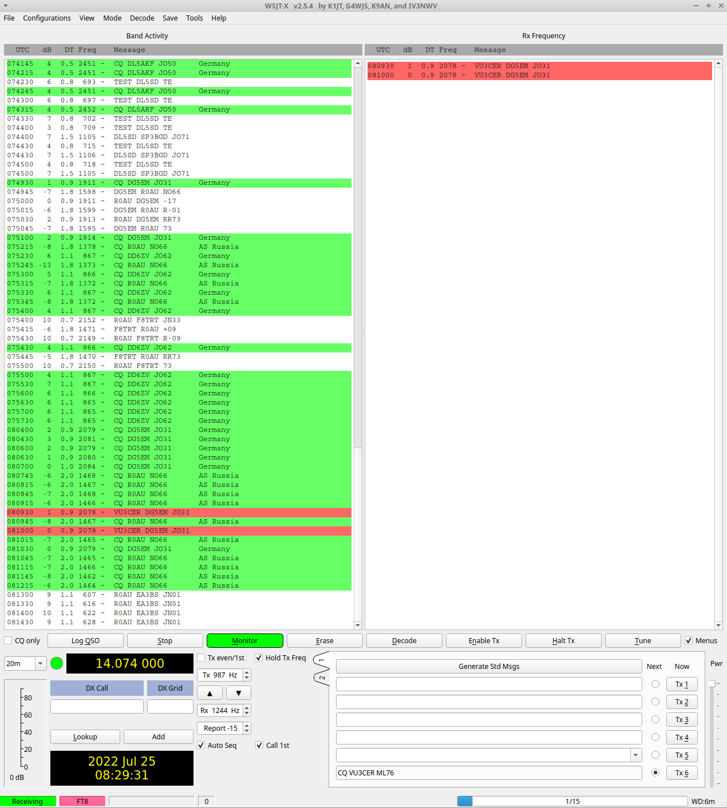

#### QO-100-FT8-Monitor

A program to detect if FT8 is active on QO-100 in real-time.

A secondary purpose is to eliminate the need for a QO-100 RX chain ;)


#### Requirements

Only a PC (or Raspberry Pi) running Linux (Ubuntu / Debian / Raspberry Pi OS)
with an internet connection is required.

No special hardware is needed.


#### Setup

Install dependencies:

```
pip install -r requirements.txt
```

```
sudo apt install build-essentials -y
```

```
mkdir -p ~/repos
cd ~/repos
git clone https://github.com/kgoba/ft8_lib.git
cd ~/repos/ft8_lib
make -j8
```

Next, execute the following command:

````
pacmd load-module module-null-sink sink_name=Virtual0
pacmd update-sink-proplist Virtual0 device.description=Virtual0
pacmd update-source-proplist Virtual0.monitor device.description=Virtual0
````

Next, use `pavucontrol` to redirect the audio output of the browser process to
`Virtual0` stream.



Also, connect the input audio stream of this program to `Virtual0` using
pavucontrol.



[OPTIONAL] You may also connect WSJT-X to the `Virtual0` stream for parallel
FT8 decoding, and spotting.




#### Usage

Modify file paths in `monitor.py` to suit your environment.


```
$ python monitor.py
[10:49:46.030321] FT8 is active on QO-100 satellite!
[10:50:16.047004] FT8 is active on QO-100 satellite!
[10:50:31.012215] FT8 is active on QO-100 satellite!
[10:50:46.015887] FT8 is active on QO-100 satellite!
```


#### Ideas

- Integrate with `python-telegram-bot` for getting real-time FT8 activity
  alerts on mobile phones.

- Do the same thing (i.e. FT8 traffic detection) without using `ft8_lib` (hard
  dsp problem?)

- This program can also be used as a decent QO-100 FT8 receiver. We only need
  the QO-100 TX chain now to have satellite QSO(s)!
